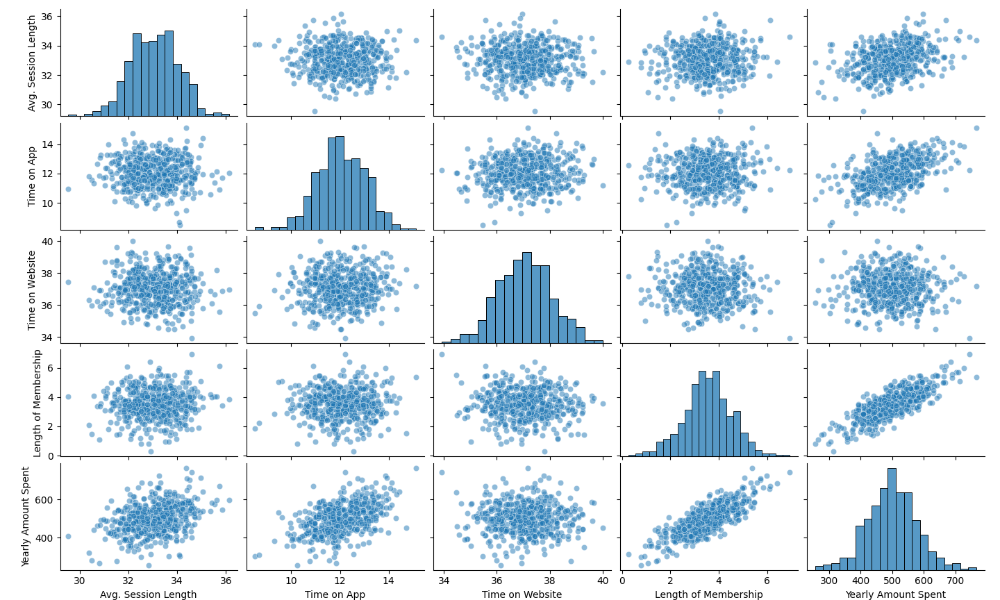
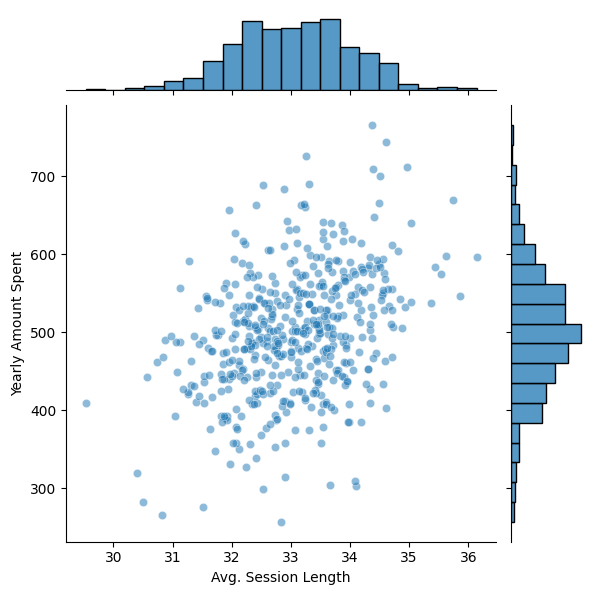
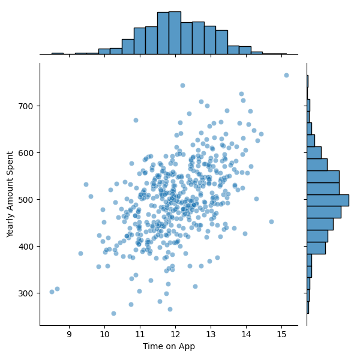
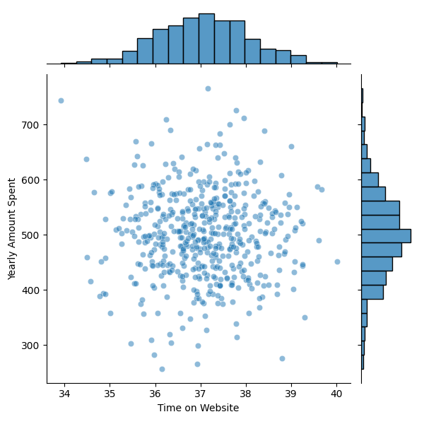
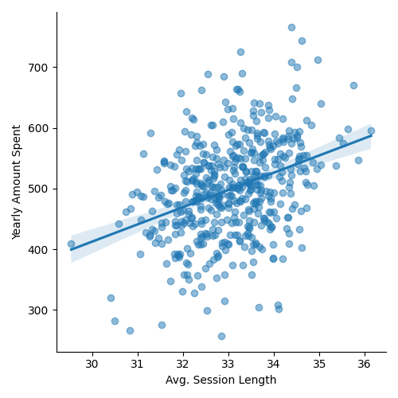
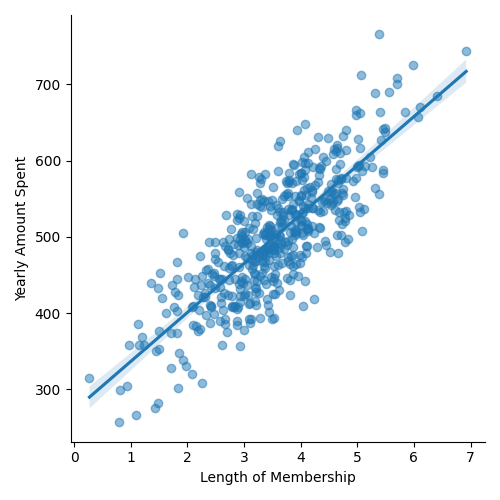
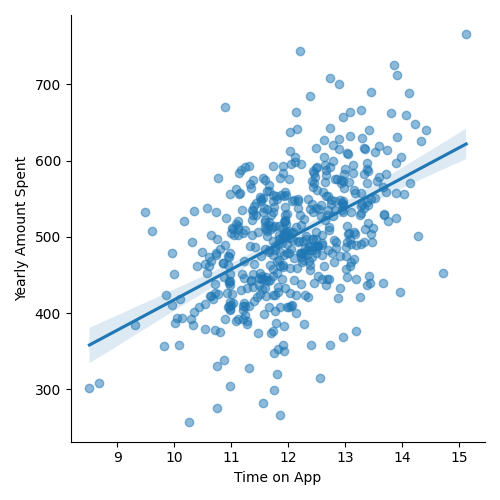
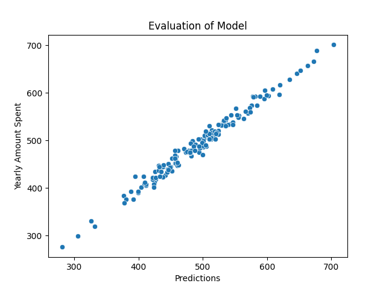

# 📊 Linear Regression — E-Commerce Spending

A clean, reproducible workflow for exploring an e-commerce dataset and building a multiple linear regression model to predict **Yearly Amount Spent**.

> **Repo:** `migzster-snow/linear-regression-ecommerce`  
> **Main script:** `main.py`  
> **Data:** `ecommerce.csv` (from Kaggle: [Linear Regression E-commerce Dataset](https://www.kaggle.com/datasets/kolawale/focusing-on-mobile-app-or-website))


---

## 🚀 Quick Start

```bash
# 1) Create a virtual environment (recommended)
python -m venv .venv && source .venv/bin/activate  # Windows: .venv\\Scripts\\activate

# 2) Install dependencies
pip install -r requirements.txt

# 3) Run the analysis
python main.py
```

Running `main.py` will:
- Load `ecommerce.csv`
- Perform EDA (pairplots & jointplots)
- Train/test split (70/30)
- Fit a **LinearRegression** model on 4 features
- Save figures to PNG files in the repo root

---

## 📦 Requirements

All dependencies are listed in **`requirements.txt`**. Core libraries include:

- `pandas`
- `matplotlib`
- `seaborn`
- `scikit-learn`
- `scipy`

---

## 🧾 Dataset

The dataset is sourced from Kaggle: [Linear Regression E-commerce Dataset](https://www.kaggle.com/datasets/kolawale/focusing-on-mobile-app-or-website).

`ecommerce.csv` has 500 rows with these columns:

- `Email` (object)
- `Address` (object)
- `Avatar` (object)
- `Avg. Session Length` (float)
- `Time on App` (float)
- `Time on Website` (float)
- `Length of Membership` (float, years)
- `Yearly Amount Spent` (float, USD — **target**)

Typical summary (from `df.describe()`):

- **Avg. Session Length** mean ≈ 33.05 (σ ≈ 0.99)
- **Time on App** mean ≈ 12.05 (σ ≈ 0.99)
- **Time on Website** mean ≈ 37.06 (σ ≈ 1.01)
- **Length of Membership** mean ≈ 3.53y (σ ≈ 1.00)
- **Yearly Amount Spent** mean ≈ $499 (σ ≈ $79)

---

## 🔍 Exploratory Data Analysis (EDA)

A selection of saved figures (these are already in the repo):

- Pairwise relationships:  
  

- Jointplots (distributions + relationship):
  - 
  - 
  - 
  - 

- Linear regression fits (Seaborn `lmplot`) vs target:
  - 
  - 
  - 
  - 

**High-level insights**
- `Length of Membership` shows the strongest positive relationship with spending.
- `Time on App` tends to be more predictive than `Time on Website`.
- `Avg. Session Length` also correlates positively with spending.

---

## 🤖 Model

We train a scikit-learn `LinearRegression` using features:

```
X = [
  "Avg. Session Length",
  "Time on App",
  "Time on Website",
  "Length of Membership",
]
y = "Yearly Amount Spent"
```

**Train/Test Split**: 70/30 with `random_state=42`.

**Example coefficients** (from a representative run):

```
Avg. Session Length  →  25.72
Time on App          →  38.60
Time on Website      →   0.46
Length of Membership →  61.67
```

> Interpretation: Holding other features fixed, each additional year of membership is associated with ~$62 more yearly spend; app usage is more influential than website time.

---

## 📏 Evaluation & Residuals

**Saved evaluation plots**

- Predictions vs Actual:  
  

- Residuals histogram:  
  

- Q-Q plot:  
  

**Typical error metrics** (30% test set):

```
MAE  ≈  8.43
MSE  ≈  103.92
RMSE ≈  10.19
```

Residuals are approximately normal and centered around zero, supporting linearity and homoscedasticity assumptions for this simple model.

---

## 📁 Project Structure

```
.
├── ecommerce.csv
├── main.py
├── requirements.txt
├── LICENSE
├── pairplot.png
├── jointplot_avg_session_length_vs_time_on_website.png
├── jointplot_length_of_membership_vs_time_on_website.png
├── jointplot_time_on_app_vs_time_on_website.png
├── jointplot_yearly_amount_spent_vs_time_on_website.png
├── lmplot_avg_session_length_vs_yearly_amount_spent.png
├── lmplot_length_of_membership_vs_yearly_amount_spent.png
├── lmplot_time_on_app_vs_yearly_amount_spent.png
├── lmplot_time_on_website_vs_yearly_amount_spent.png
├── evaluation_of_model.png
├── histogram of residuals.png
└── probability plot.png
```

---

## 📄 License

This project is licensed under the **MIT License**. See the [LICENSE](LICENSE) file for details.
